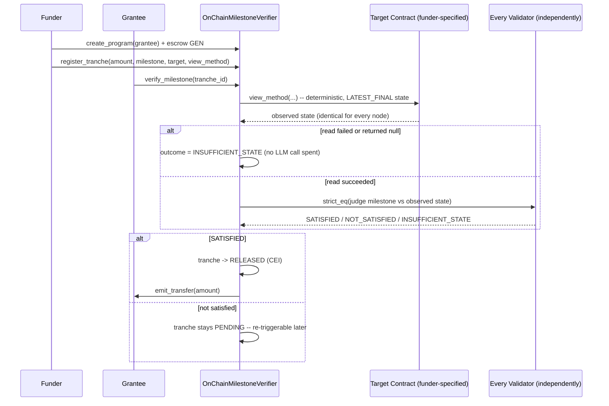

# OnChainMilestoneVerifier

A reusable [GenLayer](https://genlayer.com) Intelligent Contract primitive that releases escrowed grant/bounty funds only when independent validators agree that a target contract's actual, already-finalized on-chain state satisfies a plain-language milestone.

**Deployed on Testnet Bradbury (current, post-fix):** [`0xDe1817Aa376Dc25cC2dF36a0738a615E1B215836`](https://explorer-bradbury.genlayer.com/address/0xDe1817Aa376Dc25cC2dF36a0738a615E1B215836) — deploy tx `0x4a979ae61361e4802bd3fc54ec6c8132e9f99f008a95bb57c4ca6db74f35f032`, confirmed `FINALIZED`/`AGREE`/`FINISHED_WITH_RETURN` (5/5 validators agreed), post-deploy read confirmed (`get_program_count() == 0`). This redeploy carries the fixes from the adversarial post-launch review documented in [docs/DESIGN.md §12](docs/DESIGN.md#12-a-maximally-adversarial-post-launch-review-and-the-fixes-it-produced) and `CHANGELOG.md` — see those for the full list. The mechanism itself (deterministic cross-contract read + independent judgment + fund release) was already live-verified end-to-end with real GEN on the original 1.0.0 deployment; see `CHANGELOG.md`'s `[1.0.0]` entry for that record.

## The trust problem

Grant and bounty programs today face a version of the same problem every escrow arrangement does: someone has to decide whether the work was actually done, and whoever that someone is can be captured, bribed, lazy, or simply wrong — and neither the funder nor the grantee should have to unilaterally trust the other's account of what happened. A traditional "milestone-based grant" either needs a manually-trusted reviewer, or degrades into a naive on-chain check that can only compare against a value someone typed in ahead of time — which defeats the point, since the grantee (or the funder) could have typed in whatever they wanted.

`OnChainMilestoneVerifier` closes this differently: it never asks anyone to *claim* a milestone is done. It reads the actual, already-finalized state of a real deployed contract — the same contract the work was supposedly done in — and asks every GenLayer validator, independently, whether that observed state demonstrates the milestone. Funds only move when a genuinely independent judgment says so.

## What it does

A funder:

1. **Creates a program** for a grantee, escrowing GEN (`create_program`).
2. **Registers one or more tranches** against that escrow (`register_tranche`), each naming an amount, a plain-language milestone description, a target contract address, and which view method on that contract to read (with optional arguments).

Either the funder or the grantee can then:

3. **Trigger verification** (`verify_milestone`) at any time — including repeatedly, as the target contract's state evolves. This performs a deterministic read of the named view method against the target contract's finalized state, then asks every validator independently whether that observed state satisfies the milestone. Only a confident, independently-reproduced `SATISFIED` releases the tranche's GEN to the grantee.

## Why this is a different evidence model than a web-fetch oracle

A prior primitive in this account's portfolio ([IndependentCanonicalExtractor](https://github.com/Fortune9thx/independent-canonical-extractor)) grounds its judgments in fetched web pages — content that is not part of any blockchain's canonical state and can differ between two fetches milliseconds apart, so every validator must independently *re-fetch* the evidence inside the non-deterministic block.

A deployed GenVM contract's own **finalized** state is different in kind: once finalized, it is canonical and identical for every node that reads it, by the same guarantee that makes the rest of the chain deterministic in the first place. So this contract's cross-contract read happens exactly once, in the ordinary **deterministic** body of `verify_milestone` — not inside any non-deterministic block (which is exactly where cross-contract calls are forbidden on GenVM, `SystemError: 6`). Only the *judgment* of that already-agreed state is genuinely non-deterministic, and that's the one thing `gl.eq_principle.strict_eq` independently re-derives on every validator.



## Why funds only move through a rigid, bounded outcome

The only thing this contract's Equivalence Principle round ever agrees on is one of exactly three values: `SATISFIED`, `NOT_SATISFIED`, `INSUFFICIENT_STATE`. No confidence score, no partial-satisfaction percentage, no free-text rationale that consensus has to agree on byte-for-byte — the same unbound-quantitative-outcome failure mode that has been a real, documented GenLayer Portal rejection reason in this account's history. Only `SATISFIED` ever triggers a transfer, and that happens strictly after every agreeing validator reproduced the identical judgment independently.

## Why the target view method is called by name, not a fixed interface

`view_method` is a caller-supplied string, resolved at call time via `getattr(contract.view(state=...), view_method)(*args)` — GenLayer's own cross-contract proxy mechanism supports this natively (`__getattr__`-based dynamic dispatch), confirmed by direct testing before this contract was written, not assumed. This is what makes the contract a genuinely reusable verification layer for any view method taking no arguments, or only `str`/`int`/`bool` arguments — a view method requiring an `Address`, `bytes`, or a nested/structured argument is out of scope, since there is no coercion layer from JSON-decoded primitives to those richer calldata types.

## Why re-verification requires genuine state change, and is hard-capped

`verify_milestone`'s judgment is a real LLM call, and `gl.eq_principle.strict_eq` only guarantees that *whatever* a given round's independent judgments agree on is accepted — it does not guarantee two separate rounds over the identical, unchanged observed state will agree with *each other*. Left ungated, a party to a tranche could re-trigger verification against the same unchanged target state indefinitely, for gas alone, until one round's independent judgments happened to land on an unwarranted `SATISFIED` — a small, bounded cost against the full tranche amount as payoff. Two gates close this: (1) each attempt's observed-state hash must differ from the tranche's last attempt, checked and enforced *before* any LLM call or storage write, so a same-state retry costs only the deterministic read; (2) total attempts per tranche are hard-capped at `MAX_VERIFICATION_ATTEMPTS_PER_TRANCHE`, regardless of whether each attempt's state technically differed, closing the loophole where a target contract's own operator could otherwise oscillate its state between a couple of values purely to keep re-arming gate (1).

## Contract interface

| Method | Kind | Description |
|---|---|---|
| `create_program(grantee: str) -> str` | write, payable | Escrows `msg.value` GEN for `grantee`, returns the new `program_id` |
| `register_tranche(program_id, amount, milestone_description, target_contract, view_method, view_args_json="[]") -> str` | write | Funder-only. Registers a milestone-gated tranche against the program's unallocated escrow, returns `tranche_id` |
| `verify_milestone(tranche_id) -> str` | write | Funder-or-grantee. Deterministic read + independent judgment; releases funds on `SATISFIED`. Rejects a re-attempt whose observed state is unchanged since the last attempt, and caps total attempts per tranche at `MAX_VERIFICATION_ATTEMPTS_PER_TRANCHE`. Returns `verification_id` |
| `withdraw_unallocated(program_id) -> None` | write | Funder-only. Refunds escrow never allocated to a tranche |
| `retry_release(tranche_id) -> None` | write | Funder-or-grantee. Manual reconciliation escape hatch: re-issues the transfer for an already-`RELEASED` tranche whose original `emit_transfer` may not have arrived |
| `reclaim_stale_tranche(tranche_id) -> None` | write | Funder-only, after 90 days with no successful verification. Reclaims a tranche's allocation, marks it `EXPIRED` |
| `get_program(program_id) -> str` | view | Full JSON program record |
| `get_tranche(tranche_id) -> str` | view | Full JSON tranche record |
| `get_verification(verification_id) -> str` | view | Full JSON verification record (audit trail entry) |
| `list_program_ids() -> DynArray[str]` | view | Every program ever created |
| `list_tranche_ids(program_id) -> str` | view | JSON array of every tranche registered against a program |
| `list_verification_ids(tranche_id) -> str` | view | JSON array of every verification attempt for a tranche (full re-trigger history) |
| `list_tranches_for_grantee(grantee) -> str` | view | JSON array of every tranche ever registered for a grantee, across all programs — a grantee's track record |
| `get_program_count() -> u256` | view | Total programs ever created |

## Integration example

See [`examples/deployment_status_target.py`](examples/deployment_status_target.py) — a minimal deployed target contract exposing a `deployment_status()` view method, and the exact `register_tranche` call a funder would make to gate a tranche on it.

```bash
# 1. Funder creates a program and escrows funds for the grantee.
#    create_program is @gl.public.write.payable -- consult `genlayer write --help`
#    for your installed CLI's exact value-sending flag/flow (this repo's own
#    live deployment used a genlayer-js script rather than the bare CLI for
#    this specific call; see PORTAL_SUBMISSION.md for the real transaction).
genlayer write <verifier_address> create_program --args "<grantee_address>"

# 2. Funder registers a tranche gated on a real deployed contract's own state
genlayer write <verifier_address> register_tranche \
  --args "program-0" 500000000000000000 \
    "the target contract's deployment_status() view returns \"LIVE\"" \
    "<target_contract_address>" "deployment_status" "[]"

# 3. Either party triggers verification once the grantee believes the work is done
genlayer write <verifier_address> verify_milestone --args "program-0-tranche-0"
```

## Why GenLayer is required

A traditional escrow contract can check a value someone submitted; it cannot independently *observe and interpret* another contract's real state the way this does. GenLayer's validator set running the identical deterministic read and then independently judging it via the Equivalence Principle is what turns "trust whoever reports the milestone is done" into "trust that every validator who voted read the exact same on-chain fact and reached the exact same conclusion." That's only possible on a chain with native, protocol-level non-deterministic execution and consensus over its result — see [docs/DESIGN.md](docs/DESIGN.md) for the full architecture rationale, including an honest account of a real bug this contract's own test suite caught before deployment.

## Repository layout

```
contracts/OnChainMilestoneVerifier.py   the contract
tests/direct/                           gltest direct-mode test suite (36 tests)
docs/DESIGN.md                          deep design rationale, threat model, integration guide
docs/WHY_THIS_PASSES_REVIEW.md          mapping against known Portal rejection patterns and gate criteria
examples/deployment_status_target.py        a minimal target contract + the tranche registration that gates on it
PORTAL_SUBMISSION.md                    submission text for the GenLayer Portal
FINAL_CHECKLIST.md                      pre-submission verification checklist
.github/workflows/ci.yml                genvm-lint (check + validate) + gltest run on every push
```

## Testing

```bash
pip install genlayer-test genvm-linter Pillow
genvm-lint check contracts/OnChainMilestoneVerifier.py
genvm-lint validate contracts/OnChainMilestoneVerifier.py
gltest tests/direct/test_onchain_milestone_verifier.py -v
```

36 direct-mode tests covering the full program → tranche → verify → release lifecycle, fund-accounting correctness (escrow, allocation, release, unallocated withdrawal, stale-tranche reclaim with CEI ordering throughout), authorization on every write method, input validation, the deterministic-read-failure short-circuit (verified to skip the LLM call entirely), and the pure helper functions in isolation. `genvm-lint check`/`validate` both pass with zero warnings. Because this contract's core mechanism (dynamic cross-contract view calls) has no built-in mock in `gltest`'s direct mode, a project-specific mock (`tests/direct/conftest.py::install_call_contract_mock`) was built and validated with a standalone probe *before* the real contract was written — see [docs/DESIGN.md](docs/DESIGN.md) for that process, including a real bug the test suite caught mid-build.

## License

[MIT](LICENSE)
